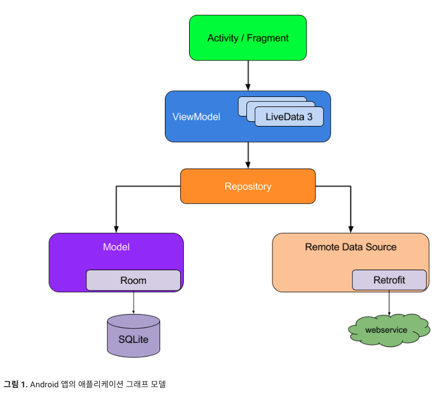

# Dependency injection

- [Dependency injection](https://developer.android.com/training/dependency-injection)

- 코드 재사용 가능
- 리팩토링 편의성
- 테스트 편의성

## 종속 항목 삽입의 기본사항

예를 들어 Car 클래스는 Engine 클래스 참조가 필요할 수 있습니다. 이처럼 필요한 클래스를 종속 항목이라고 하며, 이 예에서 Car 클래스가 실행되기 위해서는 Engine 클래스의 인스턴스가 있어야 합니다.

클래스가 필요한 객체를 얻는 세 가지 방법은 다음과 같습니다.

1. 클래스가 필요한 종속 항목을 구성, 위의 예에서 Car는 자체 Engine 인스턴스를 생성하여 초기화함
2. 다른 곳에서 객체를 가져옴, Context getter 및 getSystemService() 와 같은 일부 안드로이드 API는 이러한 방식으로 작동
3. 객체를 매개변수로 제공받음, 앱은 클래스가 구성될 때 이러한 종속 항목을 제공하거나 각 종속 항목이 필요한 함수에 전달 할 수 있음, 위의 예에서 Car 생성자는 Engine을 매개변수로 받음

3번이 종속 항목 삽입

```kotlin
class Car {

    private val engine = Engine()

    fun start() {
        engine.start()
    }
}

fun main(args: Array) {
    val car = Car()
    car.start()
}
```

위의 예는 종속 항목 삽입 없이 구현하는 경우

```kotlin
class Car(private val engine: Engine) {
    fun start() {
        engine.start()
    }
}

fun main(args: Array) {
    val engine = Engine()
    val car = Car(engine)
    car.start()
}
```

위 예가 종속 항목 삽입 예

안드로이드에서 종속 항목 삽입을 실행하는 두가지 주요 방법

- 생성자 삽입
  - 위 방법, 클래스의 종속 항목을 생성자에 전달하는 방법
- 필드 삽입 (or setter 삽입)
  - Activity 및 Fragment와 같은 특정 안드로이드 프레임워크 클래스는 시스템에서 인스턴스화하므로 생성자 삽입이 불가능
  - 필드 삽입을 사용하면 종속 항목은 클래스가 생성된 후 인스턴스화 됨
  - 아래가 그 예시

```kotlin
class Car {
    lateinit var engine: Engine

    fun start() {
        engine.start()
    }
}

fun main(args: Array) {
    val car = Car()
    car.engine = Engine()
    car.start()
}
```

### 종속 항목 자동 삽입

종속 항목 직접 삽입, 종속 항목 수동 삽입을 기존에 썼는데 이 프로세스를 자동화

자동화 라이브러리가 아래와 같이 크게 두 분류가 있음

- 런타임 시 종속 항목을 연결하는 리플렉션 기반 솔루션
- 컴파일 시간에 종속 항목을 연결하는 코드를 생성하는 정적 솔루션

- Dagger는 Google에서 유지 관리하며 자바, Kotlin 및 Android용으로 널리 사용되는 종속 항목 삽입 라이브러리
- Dagger는 종속 항목 그래프를 자동으로 생성하고 관리하여 앱에서의 DI 사용을 용이하게 함
- Guice 같은 리플렉션 기반 솔루션의 여러 개발 및 성능 문제를 해결하는 완전 정적 및 컴파일 시간 종속 항목을 제공

## 종속 항목 삽입의 대안

종속 항목 삽입의 대안은 ServiceLocator를 사용하는 것

```kotlin
object ServiceLocator {
    fun getEngine(): Engine = Engine()
}

class Car {
    private val engine = ServiceLocator.getEngine()

    fun start() {
        engine.start()
    }
}

fun main(args: Array) {
    val car = Car()
    car.start()
}
```

ServiceLocator 패턴은 요소가 소비되는 방식에서 종속 항목 삽입과 다름

ServiceLocator은 종속 항목 삽입과 다른거임

## 안드로이드 앱에서 Hilt 사용

Hilt는 안드로이드에서 종속 항목을 삽입하기 위한 Jetpack 권장 라이브러리

Hilt는 Dagger가 제공하는 컴파일 시간 정확성, 런타임 성능, 확장성 및 안드로이드 스튜디오 지원의 이점을 누리기 위해 인기 있는 DI 라이브러리인 Dagger를 기반으로 빌드됨

# 종속 항목 수동 삽입



# Hilt를 사용한 종속 항목 삽입


