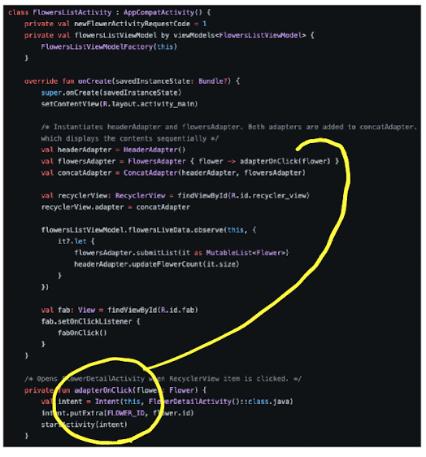
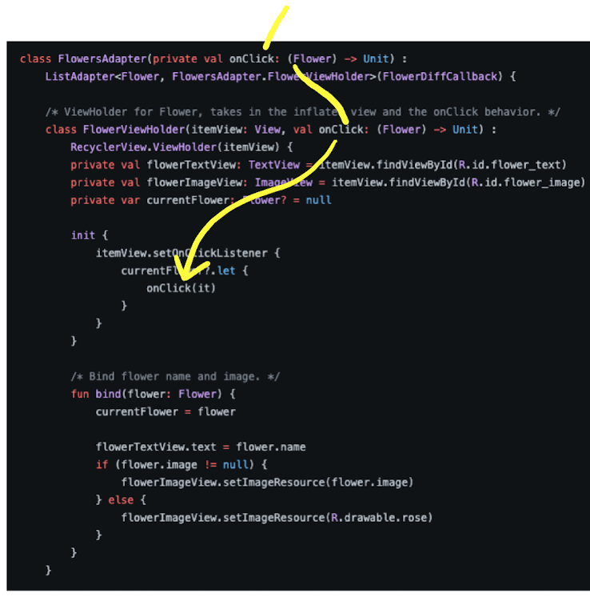

# RecyclerView

- [docs: Create dynamic lists with RecyclerView](https://developer.android.com/develop/ui/views/layout/recyclerview)
- [코틀린 샘플](https://github.com/android/views-widgets-samples/tree/main/RecyclerViewKotlin/)

## 코틀린 샘플

onClick 구현
