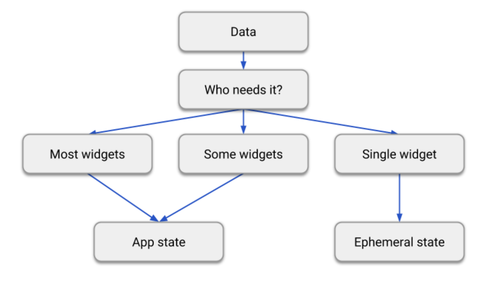

# Differentiate between ephemeral state and app state

- [docs: Differentiate between ephemeral state and app state](https://docs.flutter.dev/development/data-and-backend/state-mgmt/ephemeral-vs-app)

일시적인 state와 app state 구분

## 일시적인 상태

(UI state or local state 라고도 함)

일시적인 상태는 single 위젯을 포함할 수 있는 상태

예를 들면

- PageView 안에 현재 페이지
- 복잡한 애니메이션의 현재 progress
- BottomNavigationBar 안에 현재 선택된 탭

일시적인 state에 필요한건 StatefulWidget 뿐

```dart
class MyHomepage extends StatefulWidget {
  const MyHomepage({super.key});

  @override
  State<MyHomepage> createState() => _MyHomepageState();
}

class _MyHomepageState extends State<MyHomepage> {
  int _index = 0;

  @override
  Widget build(BuildContext context) {
    return BottomNavigationBar(
      currentIndex: _index,
      onTap: (newIndex) {
        setState(() {
          _index = newIndex;
        });
      },
      // ... items ...
    );
  }
}
```

위 예제에서 _index 변수가 일시적인 state

- setState() 를 사용
- StatefulWidget의 State 클래스 내부 필드 사용

ㅇㅇ...

## 앱 상태

shared state 이라고도 함

일시적인 상태가 아닌 앱의 많은 parts에서 share 하고 싶고

사용자 세션 사이에서 keep 하고 싶은 state를

application state 이라고 부름

예를 들면

- 사용자 기본 설정
- 로그인 정보
- 소셜 네트워킹 앱 알림
- 이커머스 앱 쇼핑 카트
- 뉴스 앱에서 기사 읽음/읽지 않음 상태

## There is no clear-cut rule




