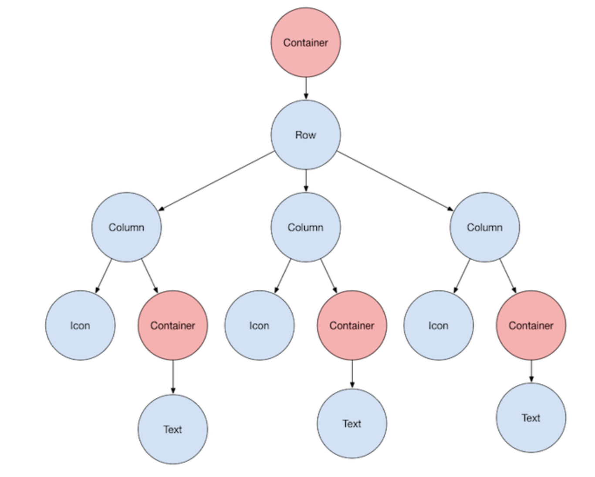

# Layout

- [docs: Layout](https://docs.flutter.dev/development/ui/layout)

## 컨테이너


 
- child 위젯을 커스텀 할 수 있는 위젯 클래스
- 패딩, 마진, borders, 배경색을 추가 할 때 쓰임
- 위 사진에서 Text 위젯에 마진을 추가 하기 위해서 컨테이너 안에 놓임
- 그리고 위 사진에서 Row가 컨테이너 안에 있는데 Row 주변에 패딩을 주기 위해서 놓임

## 위젯
- [위젯 종류](https://docs.flutter.dev/development/ui/widgets/layout)
- 텍스트, 버튼 이런거도 위젯이지만 마진, 패딩 이런거도 위젯에 들어감

모든 레이아웃 위젯은 둘 중 하나임
- Center or Container 요런거는 자식 하나를 가짐 (child)
- Row, Column, ListView, Stack 뭐 요런거는 다수 위젯을 가짐 (children)

```dart
const Center(
  child: Text('Hello World'),
),
```

예를 들면 위와 같이 Center는 child를 가짐

플러터 앱은 그 자체로 위젯임

대부분 위젯에는 build() 메소드를 가지고 있음

build() 메소드 안에서 위젯을 인스턴스화하고 반환하면 위젯이 표시됨


