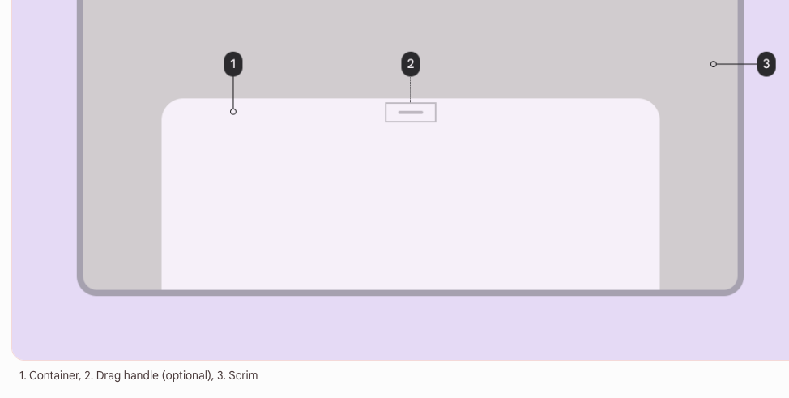

# Bottom sheets

- [docs: Bottom sheets](https://m3.material.io/components/bottom-sheets/overview)

## What's new

- 양 위쪽 corner radius는 28dp
- New max-width of 640dp
- optional drag handle with an accessible 48dp hit target
  - drag handle은 위에 작은 가로 줄을 의미함



> 아직 문서 작성 중인 듯

## Standard bottom sheet

bottom sheet 열어도 뒤는 그대로

뒤랑 상호작용 가능

### 구현

```xml
<androidx.coordinatorlayout.widget.CoordinatorLayout
  ...>

  <FrameLayout
    android:id="@+id/standard_bottom_sheet"
    style="@style/Widget.Material3.BottomSheet"
    android:layout_width="match_parent"
    android:layout_height="match_parent"
    app:layout_behavior="com.google.android.material.bottomsheet.BottomSheetBehavior">

    <!-- Drag handle for accessibility -->
    <com.google.android.material.bottomsheet.BottomSheetDragHandleView
    android:id="@+id/drag_handle"
    android:layout_width="match_parent"
    android:layout_height="wrap_content"/>

    <!-- Bottom sheet contents. -->
    <TextView
    android:layout_width="wrap_content"
    android:layout_height="wrap_content"
    android:text="@string/title"
    .../>

    <TextView
    android:layout_width="wrap_content"
    android:layout_height="wrap_content"
    android:text="@string/supporting_text"
    .../>

    <Button
    android:id="@+id/bottomsheet_button"
    android:layout_width="wrap_content"
    android:layout_height="wrap_content"
    android:text="@string/action"
    .../>

    <com.google.android.material.switchmaterial.SwitchMaterial
    android:layout_width="wrap_content"
    android:layout_height="wrap_content"
    android:text="@string/switch_label"/>

  </FrameLayout>

</androidx.coordinatorlayout.widget.CoordinatorLayout>
```

요런식으로 해당 뷰의 child로 붙여주면 됨

CoordinatorLayout 안에 FrameLayout가 있는거임

ConstraintLayout가 아님!!

## Modal bottom sheet

bottom sheet 열면 뒤에 까매지는 거

뒤랑 상호작용 불가능

## State

- STATE_COLLAPSED: The bottom sheet is visible but only showing its peek height. This state is usually the 'resting position' of a bottom sheet, and should have enough height to indicate there is extra content for the user to interact with.
- STATE_EXPANDED: The bottom sheet is visible at its maximum height and it is neither dragging nor settling (see below).
- STATE_HALF_EXPANDED: The bottom sheet is half-expanded (only applicable if behavior_fitToContents has been set to false), and is neither dragging nor settling (see below).
- STATE_HIDDEN: 안보이고 프로그래밍 방식으로만 다시 보이게 할 수 있음
- STATE_DRAGGING: The user is actively dragging the bottom sheet up or down.
- STATE_SETTLING: The bottom sheet is settling to a specific height after a drag/swipe gesture. This will be the peek height, expanded height, or 0, in case the user action caused the bottom sheet to hide.
You can set a state on the bottom sheet:

```kotlin
bottomSheetBehavior.state = BottomSheetBehavior.STATE_COLLAPSED
```

- 참고: STATE_SETTLING 과 STATE_DRAGGING 는 프로그래밍 방식으로 세팅 불가


