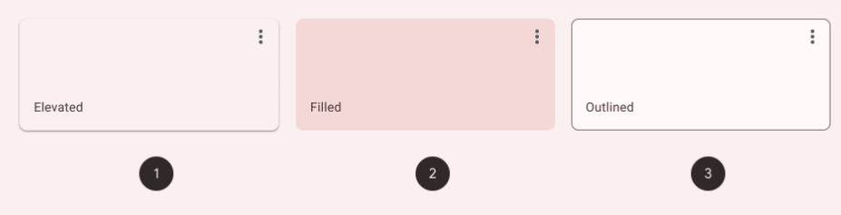
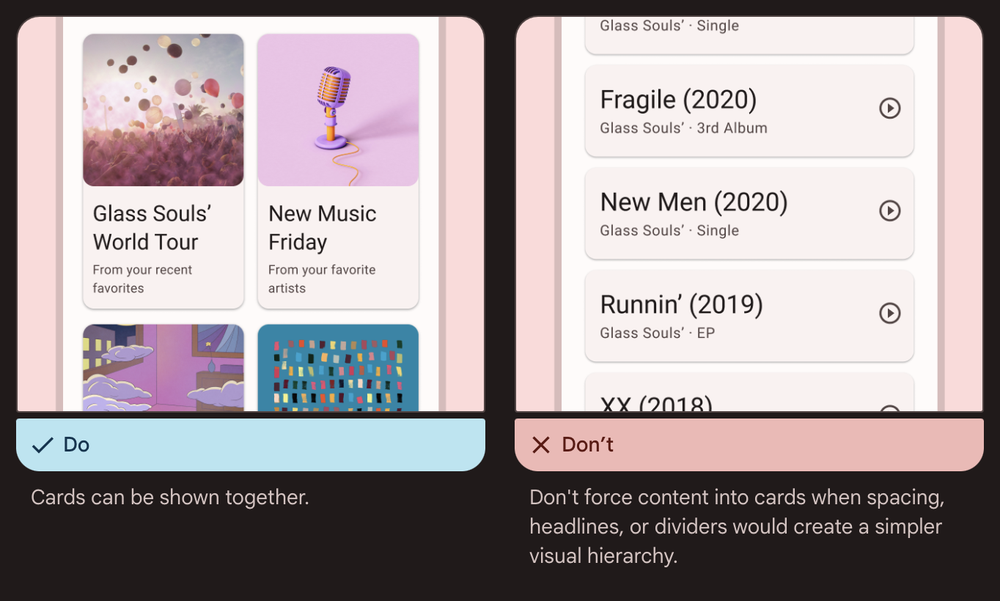

# Cards

- [Cards](https://m3.material.io/components/cards/overview)

## 구현

- [MDC-Android](https://github.com/material-components/material-components-android/blob/master/docs/components/Card.md)

## Outlined card

## 가이드라인

