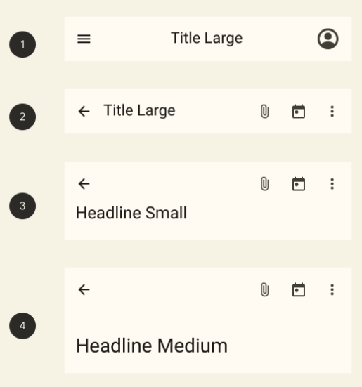

# Top app bars

- [docs: Top app bars](https://m3.material.io/components/top-app-bar/overview)

- 1: 센터 정렬
- 2: Small
- 3: Medium
- 4: Large

## 구현

- [MDC-Android](https://github.com/material-components/material-components-android/blob/master/docs/components/TopAppBar.md)

## What's new

- Elevation: 그림자 없음, 대신 color fill로 컨텐츠와 분리

