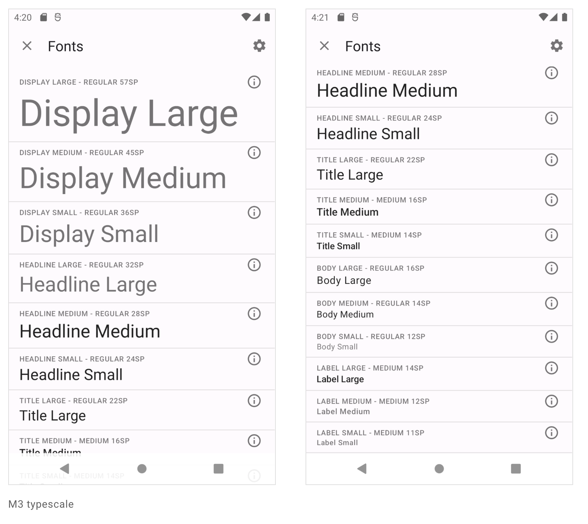

# MDC-Android

- [MDC-Android](https://m3.material.io/develop/android/mdc-android)

## M2 to M3 마이그레이션

- [Migrating to Material Design 3](https://material.io/blog/migrating-material-3)

Theme.MaterialComponents.* with Theme.Material3.* for themes

Widget.MaterialComponents.* with Widget.Material3.* for widget styles.

### M3 타이포그래피

## Material Theme Builder

- [Introducing Material Theme Builder](https://material.io/blog/material-theme-builder)

- [Visualize dynamic color](https://m3.material.io/theme-builder#/dynamic)
