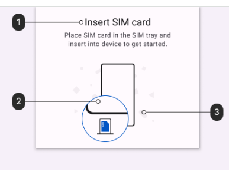
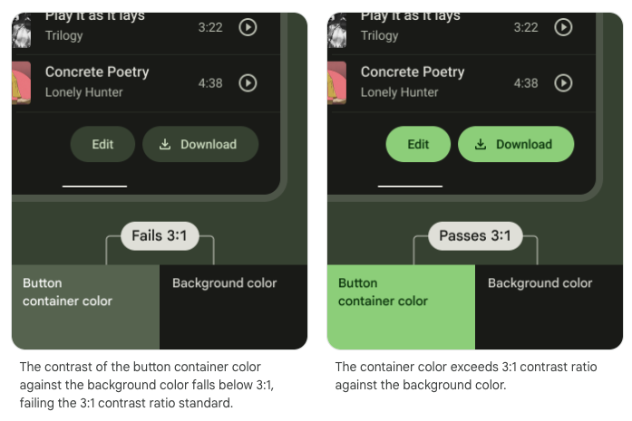

# Accessible design: Overview

- [docs: Accessible design Overview](https://m3.material.io/foundations/accessible-design/overview)

제품의 접근성을 이해하면 사용자의 저시력, 시각 장애, 청각 장애, 인지 장애, 운동 장애, 상황적 장애 (예를 들면 팔 부러짐)
이 있는 사용자를 포함한 모든 사용자의 사용성이 향상될 수 있음

## Get started

### 접근 가능한 디자인 원칙

- 개인의 요구를 예상하고 포함하며 대응해라

### 개인을 존중

- 범용 기본 환경 (Universal default experiences)은 모든 사람의 요구를 거의 충족하지 못함
- 기본 환경에서 사용자 정의 가능한 기능을 도입하면 개별 적응의 여지가 있음

### 이 후가 아닌 이 전에 배워라

- 솔루션을 정의하기 전에 다양한 능력과 삶의 경험을 가진 사용자의 요구를 이해하는데 시간을 투자하라

### starting point 로써의 요구 사항

- [docs: Requirements as a starting point](https://m3.material.io/foundations/accessible-design/overview#f820c3b1-5cda-48ae-8967-37568cb15518)

> 내용이 불분명해서 문서 참고

# Accessible design: Accessibility basics

- [docs: Accessible design Accessibility basics](https://m3.material.io/foundations/accessible-design/accessibility-basics)

## Get started

## 보조 기술

- 보조 기술은 장애가 있는 개인의 기능 능력을 향상, 유지, 개선하는데 도움이 됨
- 키보다, 화면 판독기, 점자 디스플레이와 같은 장치와 추적 입력, 돋보기, 음성 입력을 통한 기술을 사용하여 보다 독립적으로 생활 할 수 있음

### 보조 기술의 일반적인 형태

- 키보드
- 스크린 리더
- 스위치 입력

### Hierarchy

- 탐색이 쉬울 때 사용자는 앱에서 자신이 어디에 있고 무엇이 중요한지 이해를 함
- 어떤 정보가 중요한지 강조하기 위해 색상, 모양, 텍스트, 동작과 같은 여러 시각적 및 텍스트 단서가 명확성을 추가

#### 피드백 타입

- 시각적 피드백 (예를 들면 labels, 컬러, 아이콘) 및 터치 피드백은 UI에서 뭘 할수 있는지 사용자에게 보여줌

#### Navigation

추가된 버튼, 이미지, 텍스트 라인은 UI의 복잡성을 증가시킴

다음 요소들로 UI를 이해하는 방법을 단순화 할 수 있음

- 명확히 보이는 elemetns
- 충분한 대비(contrast) 와 size
- 명백한 중요도에 따른 계층
- 한 눈에 알아볼 수 있는 핵심 정보

item의 relative level of importance를 전달하려면:

- 화면 상단 또는 하단에 중요한 작업 배치 (바로 가기로 접근 가능)
- 비슷한 계층의 관련 items를 서로 옆에 배치

#### Visual hierarchy

- [docs: Visual hierarchy](https://m3.material.io/foundations/accessible-design/accessibility-basics#39f47f8a-5850-4a88-8ba9-855e911e7d12)

공식 문서의 이미지 참고

## Layout and typography

### 터치 및 포인터 타겟 크기

- 대부분의 플랫폼에서 터치 타겟은 48x48dp 이상으로 만드는 것이 좋음

> 참고로 iOS는 44x44dp를 권장

### 포인터 타겟

- 포인터 타겟은 터치 타겟과 유사하지만 마우스, 스타일러스와 같은 동작 추적 포인터 장치에 의해 구현됨
- 포인터 타겟을 최소 44x44dp 이상으로 만드는 것이 좋음

### Target spacing

- 간격은 8dp

- [docs: Target spacing](https://m3.material.io/foundations/accessible-design/accessibility-basics#2907386c-3df0-42bf-ba77-b18afb7717ae)

공식 문서 그림 참고

### 포커스 순서

입력 포커스는 일반적으로 화면 상단에서 하단으로 흐름

가장 중요한 항목에서 가장 덜 중요한 항목으로 이동 할 수 있음

포커스 포인트와 움직임을 결정하는데 도움이 되도록 다음을 고려

- elements가 포커스를 받는 순서
- elements가 그룹화되는 방식
- 포커스가 있는 element가 사라질 때 포커스가 이동하는 위치
- 시각적 indicators와 접근성 텍스트의 조합을 통해 포커스를 표현할 수 있음

### Grouping

Group items under headings that communicate what the groupings are and that content is organized spatially.

### 전환

Continuous focus traversal between screens and tasks improves the user experience, allowing for a return to a previously focused element if a task is interrupted and then resumed.

## Writing

### Accessibility text

### Alternative text (Alt text)

Alt text

### 캡션, 인접한 텍스트, 임베디드 텍스트

### 캡션

캡션은 asset 밑에 나타내는 텍스트

asset의 컨텍스트 정보 (누가, 무엇을, 언제, 어디서)를 설명

### 이미지에 포함된 텍스트

스크린 리더는 이미지에 포함된 텍스트를 읽을 수 없음

이 경우 alt text에 필수 정보를 포함

### 필수, 비필수 elements

1, 2의 경우 필수 요소

3의 경우 비필수 요소

- 필수 정보는 큰 텍스트의 경우 색상 대비 비율이 3:1
- 작은 텍스트의 경우 4.5:1

## 접근성 구현

- standard platform 을 사용 할 것

# Accessible design: Patterns

- [docs: Accessible design: Patterns](https://m3.material.io/foundations/accessible-design/patterns)

## Color & contrast

### 명암비

W3C 권장 명암비

| 텍스트 유형                                       | 색상 명암비      |
|:---------------------------------------------|:------------|
| 큰 텍스트(14 pt bold/ 18 pt regular and up), 그래픽 | 배경 대비 3:1   |
| 작은 텍스트                                       | 배경 대비 4.5:1 |

### Clustering elements

- 컨테이너 색상과 배경 색상 간의 3:1 대비 비율 충족해야 함
- 

앞에꺼는 버튼이랑 배경 색깔이랑 명암비가 3:1 이하라서 안되고

뒤에꺼는 버튼이랑 배경 색깔이랑 명암비가 3:1 초과해서 안되고

FAB 같은 경우 어차피 따로 떨어져 있어서 잘 보임

그래서 3:1 로 해서는 딱히 이점을 얻지 못함

# Accessible design: Design to implementation

- [docs: Accessible design: Design to implementation](https://m3.material.io/foundations/accessible-design/design-to-implementation)

## 접근 가능한 UX 설계 및 구현

## Overview

접근성을 위해 지정해야 하는 product의 3가지 key areas

- 구조
- 흐름
- 화면의 elements

## Structure: Web Landmarks and headings

## Flow: Focus order & key traversal

## Elements

