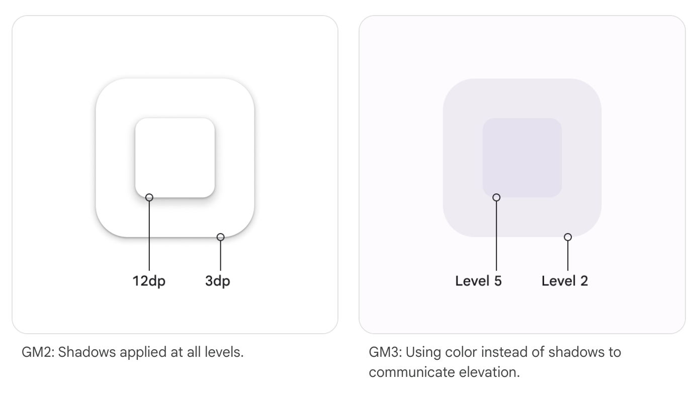

# Styles

- [docs: Styles](https://m3.material.io/styles)

## Color

### Resources

현재는

- MDC-Android
- Flutter

에서만 사용 가능

- [Resources](https://m3.material.io/styles/color/overview#4f6a95eb-8f29-431b-8c05-c2de50e5103e)

여기서 업데이트 체크

### Takeaways

### What's new

#### 다이나믹 컬러

#### 디자인 토큰 및 색상 roles

#### 접근성

## Elevation (높이, z축 기준으로 두 surfaces 사이의 상대적인 거리)

왼쪽이 1dp elevation, 오른쪽이 8dp elevation

정면에서 다르게 보임

측면으로 보면 7dp 차이

### Takeaways

- 모든 surfaces와 components에는 elevation 값이 있음
- elevation 값을 단순하게 해야 함
- 배경 색깔은 일관되게 유지되지만 surfaces는 elevation에 따라 색깔이 바뀜

### What's new

- 왼쪽 사진: 모든 레벨에 그림자 적용
- 오른쪽 사진: 그림자 대신 색깔 사용

### All surfaces and components have elevation values

- [docs: All surfaces and components have elevation values](https://m3.material.io/styles/elevation/overview#6585e78e-773c-46d2-b7e6-2eea780f7eb5)

문서 영상 참고

#### Resting elevation

- Resting elevation 은 모든 컴포넌트에 기본적으로 주어지는 elevation

#### Changing elevation

- [docs: Changing elevation](https://m3.material.io/styles/elevation/overview#25a28bbe-1a14-4d98-bef3-cff54215cf09)

영상 참고

- components는 user interaction이나 시스템 이벤트에 따라 elevation이 바뀔 수 있음

## Icons

## Motion

## Shape

## Typography

